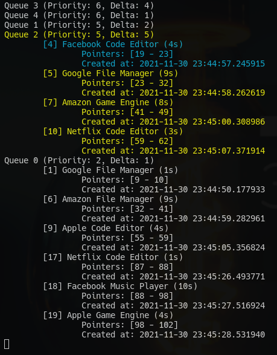

# Priority Queue

Um projeto simples para linha de comando em dart que demonstra conceitos de filas de prioridade.

## Instalação

### Pré-Requisitos

1. Instalar o [dart](https://dart.dev/get-dart#install).

### Passo-a-passo

1. Clonar o [repositório](https://github.com/h80r/so-priority-queue) do projeto.
  - Esta etapa pode ser ignorada se você estiver lendo estas instruções em um arquivo local.

2. Executar o comando `dart pub get` ou `pub get` no diretório do projeto para instalar dependências.

3. Executar o comando `dart run` na raiz do projeto para executar o programa.

## Resultados observados

Caso não seja possível executar o código, ou não seja interessante fazê-lo, realizei uma rodada de teste em meu ambiente local e disponibilizarei os resultados aqui para fácil avaliação:

